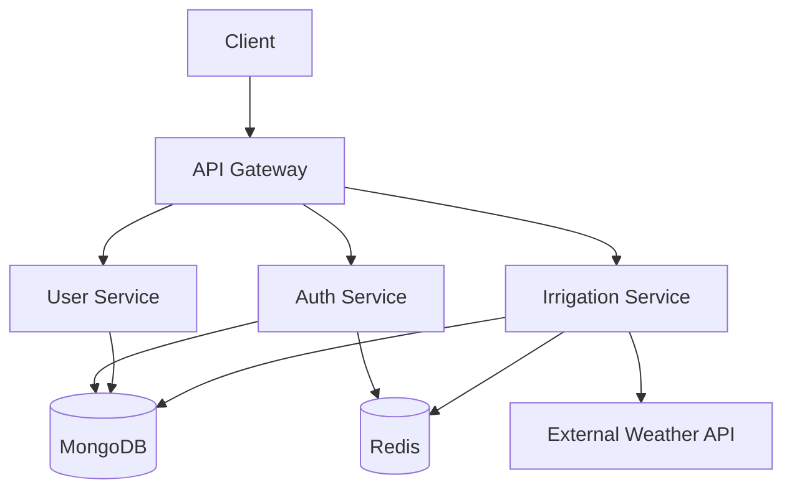
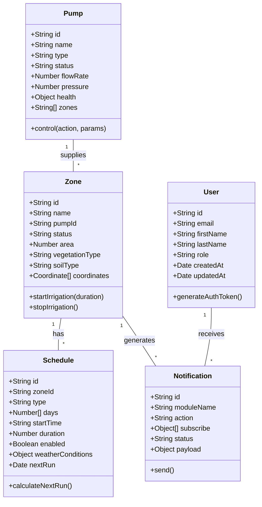
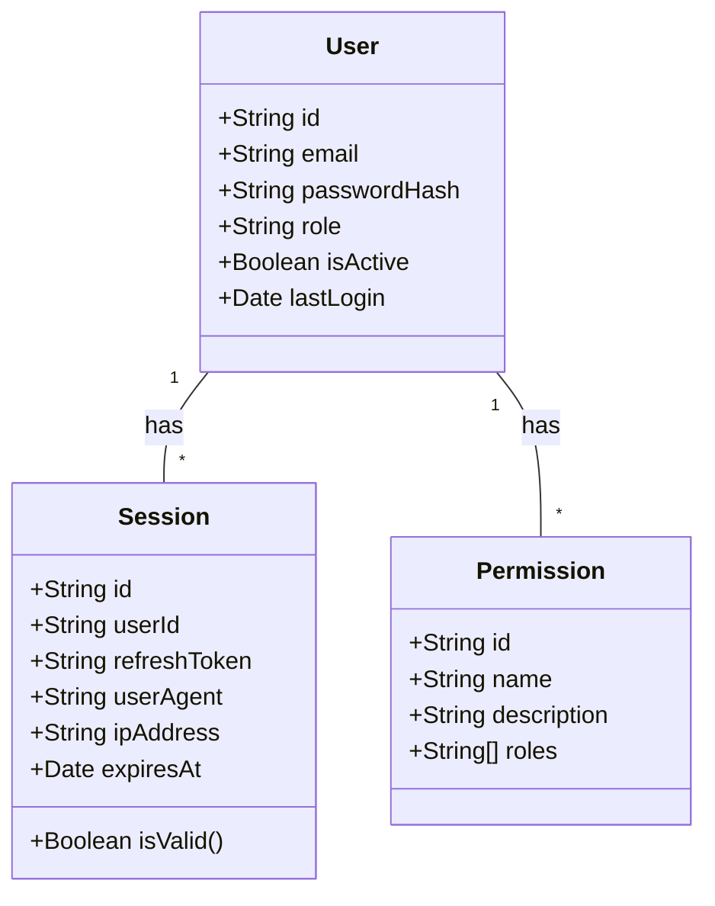
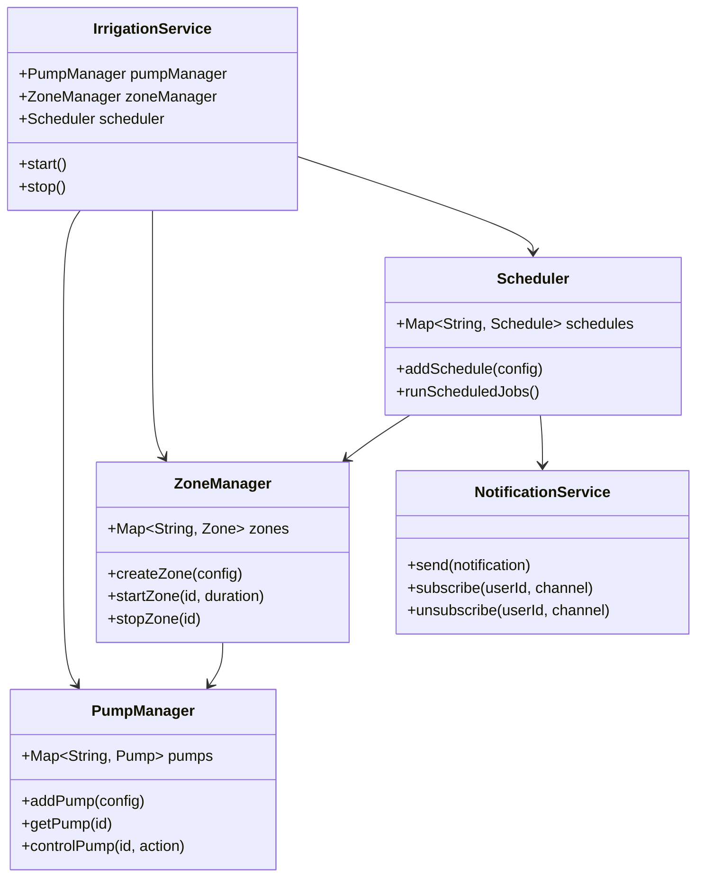
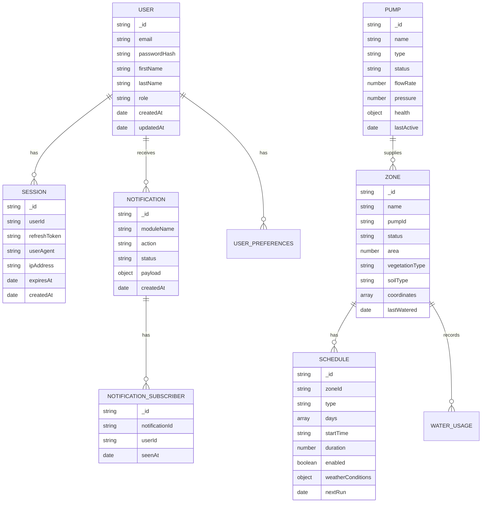

# System Architecture

## High-Level Overview

## Components

### 1. API Gateway

- Entry point for all client requests
- Request routing and load balancing
- Rate limiting and request validation
- Authentication middleware

### 2. Auth Service

- User authentication and authorization
- JWT token management
- Session handling
- OAuth2 integration

### 3. User Service

- User profile management
- Role-based access control
- Account status management
- Audit logging

### 4. Irrigation Service

- Schedule management
- Zone control
- Weather integration
- Sensor data processing

## Data Flow

1. **Authentication Flow**
   - Client sends credentials to Auth Service
   - Service validates and issues tokens
   - Tokens are used for subsequent requests

2. **User Request Flow**
   - Request hits API Gateway
   - Gateway validates token and permissions
   - Request is routed to appropriate service
   - Service processes request and returns response

## Technology Stack

### Backend

- **Runtime**: Node.js
- **Framework**: Express.js
- **Language**: TypeScript

### Database

- **Primary**: MongoDB (Document Store)
- **Cache**: Redis
- **ORM**: Mongoose

### Infrastructure

- **Containerization**: Docker
- **Orchestration**: Kubernetes (optional)
- **CI/CD**: GitHub Actions

## Data Model Architecture

### Core Domain Models

### Authentication & Authorization

### Service Layer Architecture

### Database Schema Relationships

## Security Considerations

- All communications use HTTPS
- JWT tokens with short expiration
- Rate limiting on authentication endpoints
- Input validation and sanitization
- Regular security audits

## Scalability

- Stateless services for horizontal scaling
- Database sharding for large datasets
- Caching layer for frequently accessed data
- Message queues for async processing
