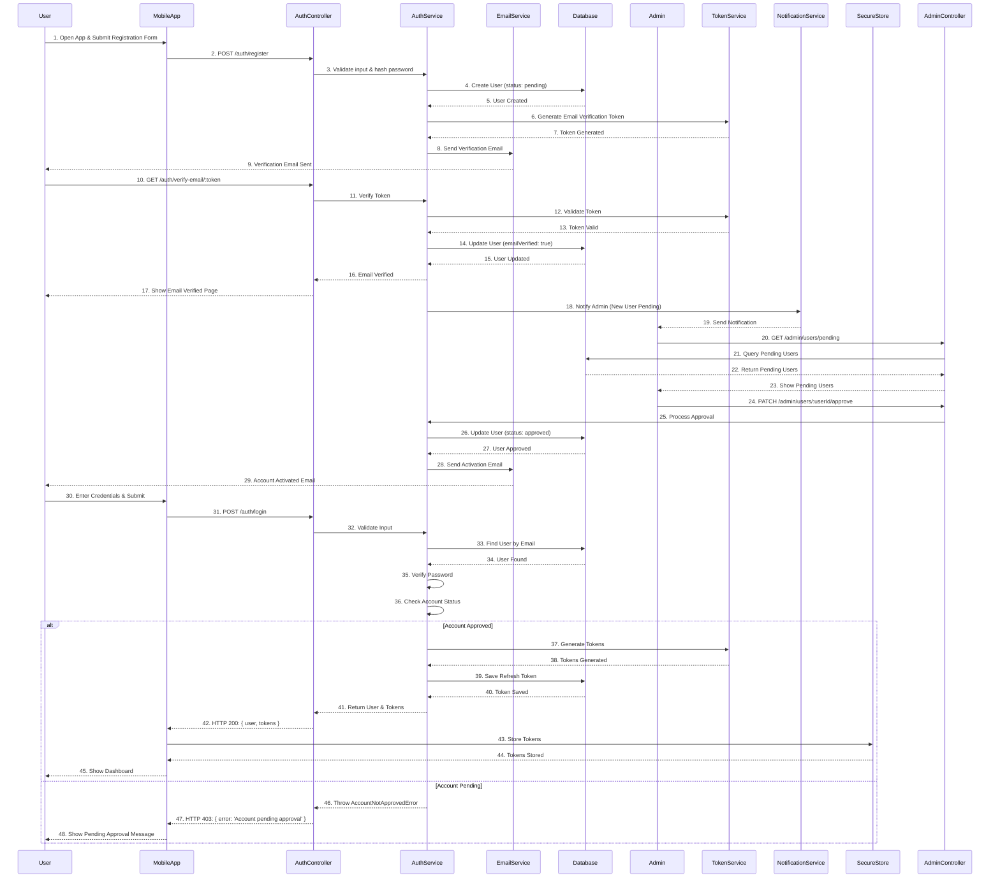
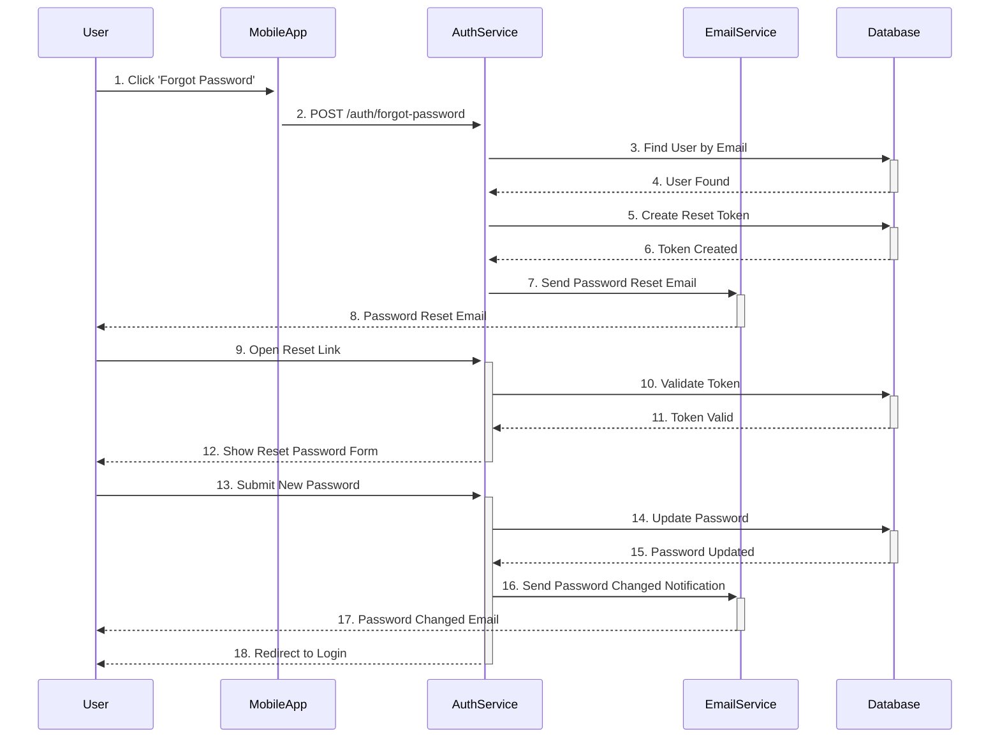

# Authentication Flow

## Architecture Overview

### Directory Structure
```
src/
├── modules/
│   └── auth/
│       ├── controllers/
│       │   ├── auth.controller.ts
│       │   └── admin.controller.ts
│       ├── services/
│       │   ├── auth.service.ts
│       │   ├── token.service.ts
│       │   └── email.service.ts
│       ├── routes/
│       │   ├── auth.routes.ts
│       │   └── admin.routes.ts
│       ├── middleware/
│       │   └── auth.middleware.ts
│       └── interfaces/
│           └── auth.interface.ts
```

### Key Components

#### Controllers
- `AuthController`
  - `register()`: Handle user registration
  - `login()`: Handle user login
  - `verifyEmail()`: Verify email address
  - `forgotPassword()`: Initiate password reset
  - `resetPassword()`: Complete password reset

- `AdminController`
  - `approveUser()`: Approve user registration
  - `listPendingUsers()`: List users pending approval

#### Services
- `AuthService`
  - `registerUser()`: Create new user
  - `verifyUserEmail()`: Verify user's email
  - `loginUser()`: Authenticate user
  - `requestPasswordReset()`: Initiate password reset
  - `resetPassword()`: Update user password

- `TokenService`
  - `generateAuthTokens()`: Generate access & refresh tokens
  - `verifyToken()`: Verify token validity
  - `blacklistToken()`: Invalidate token

- `EmailService`
  - `sendVerificationEmail()`: Send email verification
  - `sendPasswordResetEmail()`: Send password reset email
  - `sendAccountApprovedEmail()`: Notify user of approval

#### Routes
```typescript
// auth.routes.ts
router.post('/register', validate(registerSchema), authController.register);
router.post('/login', validate(loginSchema), authController.login);
router.get('/verify-email/:token', authController.verifyEmail);
router.post('/forgot-password', authController.forgotPassword);
router.post('/reset-password', validate(resetPasswordSchema), authController.resetPassword);

// admin.routes.ts
router.use(requireAdmin);
router.get('/users/pending', adminController.listPendingUsers);
router.patch('/users/:userId/approve', adminController.approveUser);
```

## User Registration & Activation



## Password Reset Flow



## Service Interactions

### Auth Service
- Handles user authentication
- Manages user sessions
- Validates tokens
- Coordinates with Email Service

### Email Service
- Sends verification emails
- Handles password reset emails
- Sends account status updates
- Manages email templates

### Database
- Stores user credentials
- Manages verification tokens
- Tracks account status
- Maintains session information
