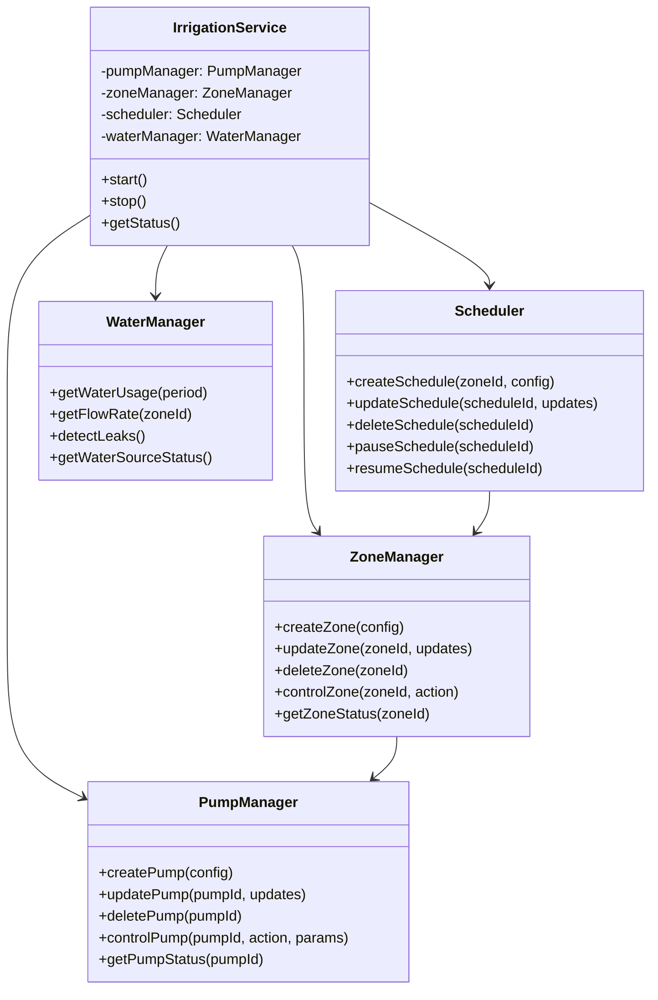
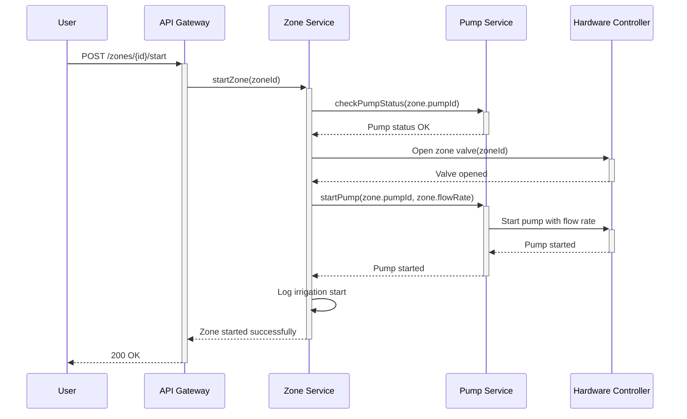

# Irrigation Service Architecture

## Table of Contents

- [Service Overview](#service-overview)
- [Core Services](#core-services)
- [API Endpoints](#api-endpoints)
- [Data Models](#data-models)
- [Sequence Diagrams](#sequence-diagrams)
- [Error Handling](#error-handling)

## Service Overview



## Core Services

### 1. Pump Manager

- Manages all pump-related operations
- Handles communication with physical/virtual pumps
- Maintains pump state and health

### 2. Zone Manager

- Manages irrigation zones
- Handles zone-pump relationships
- Controls zone valves and flow

### 3. Scheduler

- Manages irrigation schedules
- Handles one-time and recurring events
- Processes weather-based adjustments

### 4. Water Manager

- Monitors water usage
- Manages water sources
- Detects leaks and anomalies

## API Endpoints

### Pump Management

```
GET    /api/v1/pumps           # List all pumps
POST   /api/v1/pumps           # Create new pump
GET    /api/v1/pumps/:id       # Get pump details
PUT    /api/v1/pumps/:id       # Update pump
DELETE /api/v1/pumps/:id       # Remove pump
POST   /api/v1/pumps/:id/start # Start pump
POST   /api/v1/pumps/:id/stop  # Stop pump
GET    /api/v1/pumps/:id/stats # Get pump statistics
```

### Zone Management

```
GET    /api/v1/zones           # List all zones
POST   /api/v1/zones           # Create new zone
GET    /api/v1/zones/:id       # Get zone details
PUT    /api/v1/zones/:id       # Update zone
DELETE /api/v1/zones/:id       # Remove zone
POST   /api/v1/zones/:id/start # Start zone irrigation
POST   /api/v1/zones/:id/stop  # Stop zone irrigation
GET    /api/v1/zones/:id/logs  # Get zone activity logs
```

### Scheduling

```
GET    /api/v1/schedules              # List all schedules
POST   /api/v1/schedules              # Create new schedule
GET    /api/v1/schedules/:id          # Get schedule details
PUT    /api/v1/schedules/:id          # Update schedule
DELETE /api/v1/schedules/:id          # Remove schedule
POST   /api/v1/schedules/:id/activate # Activate schedule
POST   /api/v1/schedules/:id/pause    # Pause schedule
GET    /api/v1/schedules/upcoming     # Get upcoming schedule runs
```

### Water Management

```
GET    /api/v1/water/usage            # Get water usage statistics
GET    /api/v1/water/sources          # List water sources
GET    /api/v1/water/sources/:id      # Get source details
GET    /api/v1/water/alerts           # Get active water alerts
```

## Data Models

### Pump

```typescript
interface Pump {
  id: string;
  name: string;
  type: 'submersible' | 'surface' | 'booster';
  status: 'idle' | 'running' | 'fault';
  flowRate: number; // L/min
  maxPressure: number; // PSI
  powerConsumption: number; // Watts
  lastMaintenance: Date;
  health: {
    temperature: number;
    vibration: number;
    efficiency: number;
  };
  createdAt: Date;
  updatedAt: Date;
}
```

### Zone

```typescript
interface Zone {
  id: string;
  name: string;
  pumpId: string;
  area: number; // m²
  flowRate: number; // L/min
  pressure: number; // PSI
  status: 'idle' | 'irrigating' | 'paused' | 'error';
  vegetationType: string;
  soilType: string;
  coordinates: Array<{ lat: number; lng: number }>;
  createdAt: Date;
  updatedAt: Date;
}
```

### Schedule

```typescript
interface Schedule {
  id: string;
  zoneId: string;
  name: string;
  enabled: boolean;
  type: 'interval' | 'fixed' | 'weather';
  days: number[]; // 0-6 (Sun-Sat)
  startTime: string; // HH:MM
  duration: number; // minutes
  weatherConditions?: {
    minTemp?: number;
    maxTemp?: number;
    rainThreshold?: number;
    windThreshold?: number;
  };
  lastRun?: Date;
  nextRun?: Date;
  createdAt: Date;
  updatedAt: Date;
}
```

## Sequence Diagrams

### Starting Zone Irrigation



### Processing Scheduled Irrigation

```mermaid
sequenceDiagram
    participant Scheduler
    participant ZoneSvc as Zone Service
    participant Weather as Weather Service
    participant Notif as Notification Service

    Scheduler->>Scheduler: Check for due schedules
    Scheduler->>+Weather: Get forecast(zone.location)
    Weather-->>-Scheduler: Weather data

    alt Weather conditions met
        Scheduler->>+ZoneSvc: startZone(zoneId, schedule.duration)
        ZoneSvc-->>-Scheduler: Zone started

        Scheduler->>+Notif: sendNotification({
        |   type: 'irrigation_started',
        |   zone: zoneId,
        |   duration: schedule.duration
        |})
        Notif-->>-Scheduler: Notification sent
    else Weather conditions not met
        Scheduler->>+Notif: sendNotification({
        |   type: 'irrigation_skipped',
        |   zone: zoneId,
        |   reason: 'weather_conditions'
        |})
        Notif-->>-Scheduler: Notification sent
    end
```

## Error Handling

### Common Error Responses

#### 400 Bad Request

```json
{
  "error": {
    "code": "INVALID_INPUT",
    "message": "Invalid input parameters",
    "details": {
      "flowRate": "Must be between 0 and 100"
    }
  }
}
```

#### 409 Conflict

```json
{
  "error": {
    "code": "PUMP_IN_USE",
    "message": "Pump is currently in use by another zone"
  }
}
```

#### 503 Service Unavailable

```json
{
  "error": {
    "code": "HARDWARE_UNAVAILABLE",
    "message": "Unable to communicate with irrigation controller"
  }
}
```

## Implementation Notes

1. **Concurrency Control**
   - Use database transactions for multi-step operations
   - Implement mutex for pump access
   - Handle race conditions in scheduling

2. **State Management**
   - Maintain real-time state in memory
   - Persist state changes to database
   - Implement state recovery on startup

3. **Error Recovery**
   - Automatic retry for transient failures
   - Safe fallback states
   - Detailed error logging

4. **Performance**
   - Cache frequently accessed data
   - Batch database operations
   - Use connection pooling

5. **Security**
   - Input validation
   - Rate limiting
   - Authentication/authorization for all endpoints
