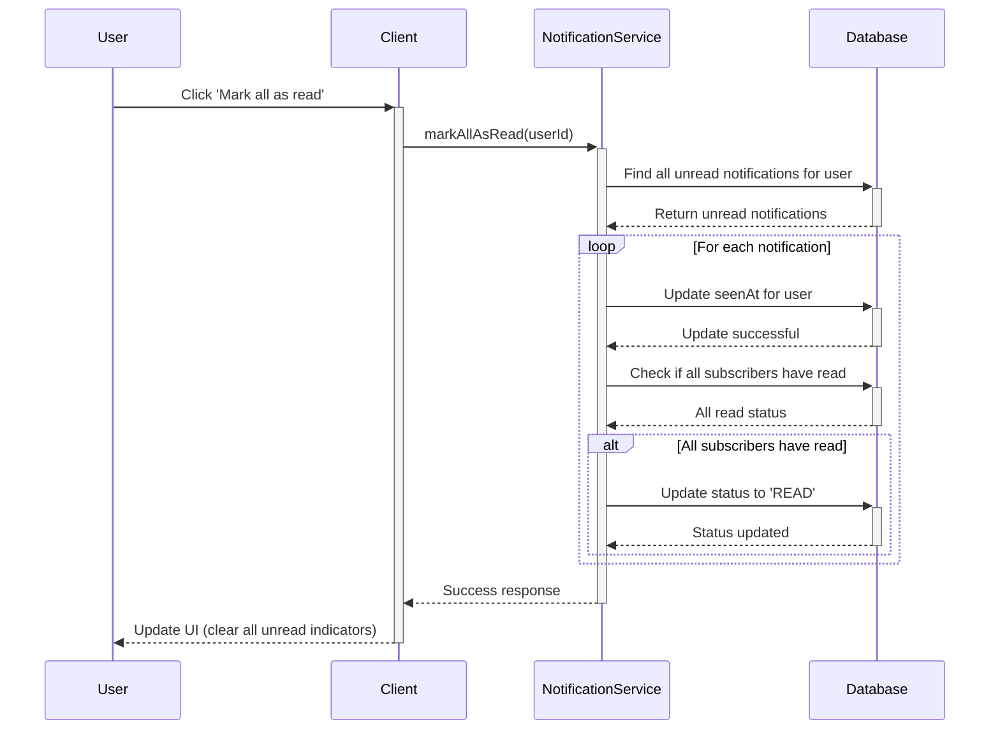

# Notification Service Flows

## Table of Contents

- [Data Models](#data-models)
- [Notification Flows](#notification-flows)
  - [1. Create Notification](#1-create-notification)
  - [2. Mark Notification as Read](#2-mark-notification-as-read)
  - [3. Mark All Notifications as Read](#3-mark-all-notifications-as-read)
  - [4. Get User Notifications](#4-get-user-notifications)
- [Error Handling](#error-handling)
- [Enums and Types](#enums-and-types)

## Data Models

### Notification Document

```typescript
interface INotificationDocument {
  id: string;
  moduleName: ModuleName; // Module that triggered the notification
  action: ActionType; // Type of action that occurred
  subscribe: INotificationSubscriber[]; // List of subscribers
  status: NotificationStatus; // Current status of the notification
  payload?: Record<string, unknown>; // Additional data
  createdAt: Date; // When the notification was created
  updatedAt: Date; // When the notification was last updated
}

interface INotificationSubscriber {
  userId: mongoose.Types.ObjectId; // ID of the user
  seenAt?: Date | null; // When the user viewed the notification
}
```

### Enums

```typescript
enum ModuleName {
  USER = 'USER',
  AUTH = 'AUTH',
  IRRIGATION = 'IRRIGATION',
  SYSTEM = 'SYSTEM',
}

enum ActionType {
  CREATED = 'CREATED',
  UPDATED = 'UPDATED',
  DELETED = 'DELETED',
  APPROVAL_REQUIRED = 'APPROVAL_REQUIRED',
  COMPLETED = 'COMPLETED',
  FAILED = 'FAILED',
}

enum NotificationStatus {
  PENDING = 'PENDING',
  SENT = 'SENT',
  READ = 'READ',
  ARCHIVED = 'ARCHIVED',
}
```

## Notification Flows

### 1. Create Notification

```mermaid
sequenceDiagram
    participant Service as Calling Service
    participant NotificationService
    participant Database
    participant WebSocket as WebSocket Service

    Service->>+NotificationService: createNotification({
    |   moduleName: 'IRRIGATION',
    |   action: 'COMPLETED',
    |   userIds: ['user1', 'user2'],
    |   payload: { /* notification data */ }
    |})

    NotificationService->>+Database: Create Notification
    Database-->>-NotificationService: Created Notification

    loop For each user
        NotificationService->>+WebSocket: Send real-time update
        WebSocket-->>-User: Push notification
    end

    NotificationService-->>-Service: Notification created
```

**Endpoint**

```http
POST /api/v1/notifications
```

**Request**

```json
{
  "moduleName": "IRRIGATION",
  "action": "COMPLETED",
  "userIds": ["user1", "user2"],
  "payload": {
    "irrigationZone": "Front Lawn",
    "duration": 30,
    "completedAt": "2025-10-02T10:00:00Z"
  }
}
```

**Response**

```json
{
  "success": true,
  "data": {
    "id": "notification123",
    "moduleName": "IRRIGATION",
    "action": "COMPLETED",
    "status": "SENT",
    "createdAt": "2025-10-02T10:00:00Z"
  }
}
```

### 2. Mark Notification as Read

```mermaid
sequenceDiagram
    participant User
    participant Client
    participant NotificationService
    participant Database

    User->>+Client: Click on notification
    Client->>+NotificationService: markAsRead(notificationId, userId)

    NotificationService->>+Database: Find notification by ID
    Database-->>-NotificationService: Return notification

    alt Notification exists and user is subscriber
        NotificationService->>+Database: Update seenAt for user
        Database-->>-NotificationService: Update successful

        NotificationService->>+Database: Check if all subscribers have read
        Database-->>-NotificationService: All read status

        alt All subscribers have read
            NotificationService->>+Database: Update status to 'READ'
            Database-->>-NotificationService: Status updated
        end

        NotificationService-->>-Client: Success response
    else Notification not found or user not subscribed
        NotificationService-->>-Client: Error response
    end

    Client-->>-User: Update UI (remove unread indicator)
```

**Endpoint**

```http
PATCH /api/v1/notifications/:id/read
```

**Response**

```json
{
  "success": true,
  "data": {
    "id": "notification123",
    "status": "READ",
    "seenAt": "2025-10-02T10:05:00Z"
  }
}
```

### 3. Mark All Notifications as Read



**Endpoint**

```http
PATCH /api/v1/notifications/read-all
```

**Response**

```json
{
  "success": true,
  "data": {
    "updatedCount": 5,
    "message": "Marked 5 notifications as read"
  }
}
```

### 4. Get User Notifications

```mermaid
sequenceDiagram
    participant User
    participant Client
    participant NotificationService
    participant Database

    User->>+Client: View notifications
    Client->>+NotificationService: getUserNotifications(userId, {
    |   status: 'UNREAD',
    |   limit: 10,
    |   page: 1
    |})

    NotificationService->>+Database: Query notifications
    Database-->>-NotificationService: Return notifications

    NotificationService-->>-Client: Paginated notifications
    Client-->>-User: Display notifications
```

**Endpoint**

```http
GET /api/v1/notifications?status=UNREAD&limit=10&page=1
```

**Response**

```json
{
  "success": true,
  "data": {
    "items": [
      {
        "id": "notification123",
        "moduleName": "IRRIGATION",
        "action": "COMPLETED",
        "status": "SENT",
        "payload": {
          "irrigationZone": "Front Lawn",
          "duration": 30
        },
        "createdAt": "2025-10-02T10:00:00Z"
      }
    ],
    "pagination": {
      "total": 15,
      "page": 1,
      "limit": 10,
      "totalPages": 2
    }
  }
}
```

## Error Handling

### Common Error Responses

#### 400 Bad Request

```json
{
  "success": false,
  "error": {
    "code": "VALIDATION_ERROR",
    "message": "Invalid module name"
  }
}
```

#### 401 Unauthorized

```json
{
  "success": false,
  "error": {
    "code": "UNAUTHORIZED",
    "message": "Authentication required"
  }
}
```

#### 403 Forbidden

```json
{
  "success": false,
  "error": {
    "code": "FORBIDDEN",
    "message": "Not authorized to view this notification"
  }
}
```

#### 404 Not Found

```json
{
  "success": false,
  "error": {
    "code": "NOT_FOUND",
    "message": "Notification not found"
  }
}
```

## Implementation Notes

1. **Real-time Updates**
   - WebSocket integration for instant notifications
   - Fallback to polling if WebSocket is not available

2. **Performance**
   - Pagination for notification lists
   - Indexing on frequently queried fields
   - Caching of recent notifications

3. **Scalability**
   - Queue-based processing for high-volume notifications
   - Batch processing for marking multiple notifications as read

4. **Security**
   - Authentication required for all endpoints
   - Users can only access their own notifications
   - Input validation for all API parameters
