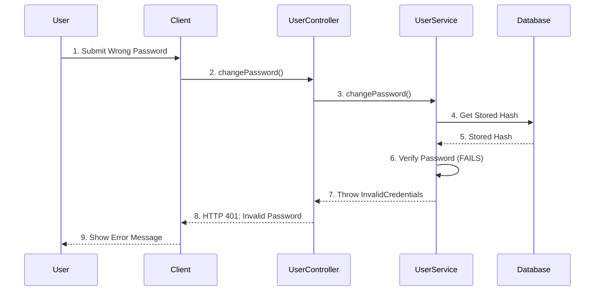
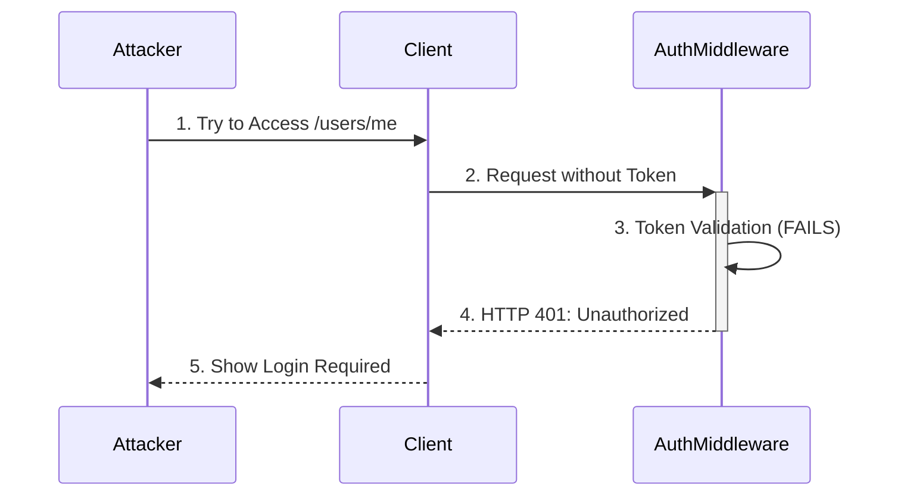
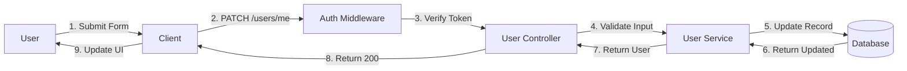
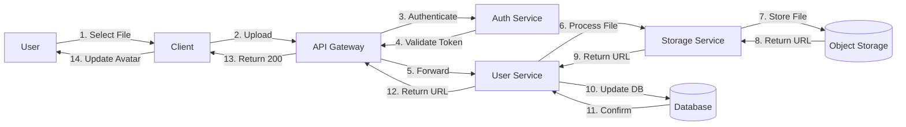

# User Service Flows

## 1. Get User Profile

```mermaid
sequenceDiagram
    participant User
    participant Client
    participant AuthMiddleware
    participant UserController
    participant UserService
    participant Database

    User->>Client: 1. View Profile
    Client->>+AuthMiddleware: 2. GET /api/v1/users/me
    AuthMiddleware->>AuthMiddleware: 3. Verify JWT Token
    AuthMiddleware->>+UserController: 4. getProfile(userId)
    UserController->>+UserService: 5. getUserById(userId)
    UserService->>+Database: 6. Query User
    Database-->>-UserService: 7. User Data
    UserService-->>-UserController: 8. Sanitized User
    UserController-->>-Client: 9. HTTP 200: User Profile
    Client-->>-User: 10. Display Profile
```

## 2. Update Profile

```mermaid
sequenceDiagram
    participant User
    participant Client
    participant AuthMiddleware
    participant UserController
    participant UserService
    participant Database

    User->>Client: 1. Edit Profile
    Client->>+AuthMiddleware: 2. PATCH /api/v1/users/me
    AuthMiddleware->>AuthMiddleware: 3. Verify JWT Token
    AuthMiddleware->>+UserController: 4. updateProfile(userId, updateData)
    UserController->>+UserService: 5. updateUser(userId, updateData)
    UserService->>+Database: 6. Update User
    Database-->>-UserService: 7. Updated User
    UserService-->>-UserController: 8. Updated User
    UserController-->>-Client: 9. HTTP 200: Updated Profile
    Client-->>-User: 10. Show Success Message
```

## 3. Change Profile Picture

```mermaid
sequenceDiagram
    participant User
    participant Client
    participant AuthMiddleware
    participant UserController
    participant UserService
    participant StorageService
    participant Database

    User->>Client: 1. Select New Photo
    Client->>+AuthMiddleware: 2. POST /api/v1/users/me/avatar
    AuthMiddleware->>AuthMiddleware: 3. Verify JWT Token
    AuthMiddleware->>+UserController: 4. uploadAvatar(userId, file)
    UserController->>+UserService: 5. updateProfilePicture(userId, file)
    UserService->>+StorageService: 6. uploadFile('avatars', file)
    StorageService-->>-UserService: 7. File URL
    UserService->>+Database: 8. Update Avatar URL
    Database-->>-UserService: 9. Updated User
    UserService-->>-UserController: 10. User with New Avatar
    UserController-->>-Client: 11. HTTP 200: New Avatar URL
    Client-->>-User: 12. Show New Avatar
```

## 4. Deactivate Account

```mermaid
sequenceDiagram
    participant User
    participant Client
    participant AuthMiddleware
    participant UserController
    participant UserService
    participant AuthService
    participant Database

    User->>Client: 1. Request Account Deletion
    Client->>+AuthMiddleware: 2. DELETE /api/v1/users/me
    AuthMiddleware->>AuthMiddleware: 3. Verify JWT Token
    AuthMiddleware->>+UserController: 4. deactivateAccount(userId)
    UserController->>+UserService: 5. deactivateUser(userId)
    UserService->>+Database: 6. Update Status (inactive)
    Database-->>-UserService: 7. User Updated
    UserService->>+AuthService: 8. revokeAllSessions(userId)
    AuthService-->>-UserService: 9. Sessions Revoked
    UserService-->>-UserController: 10. Confirmation
    UserController-->>-Client: 11. HTTP 200: Account Deactivated
    Client->>Client: 12. Clear Auth Data
    Client-->>-User: 13. Redirect to Home
```

## 5. Change Password

```mermaid
sequenceDiagram
    participant User
    participant Client
    participant AuthMiddleware
    participant UserController
    participant UserService
    participant Database

    User->>Client: 1. Submit Password Change
    Client->>+AuthMiddleware: 2. PATCH /api/v1/users/me/password
    AuthMiddleware->>AuthMiddleware: 3. Verify JWT Token
    AuthMiddleware->>+UserController: 4. changePassword(userId, passwords)
    UserController->>+UserService: 5. changePassword(userId, passwords)
    UserService->>+Database: 6. Get Current Password Hash
    Database-->>-UserService: 7. Stored Hash
    UserService->>UserService: 8. Verify Current Password
    UserService->>+Database: 9. Update Password
    Database-->>-UserService: 10. Password Updated
    UserService-->>-UserController: 11. Success
    UserController-->>-Client: 12. HTTP 200: Password Changed
    Client->>Client: 13. Force Logout
    Client-->>-User: 14. Redirect to Login
```

## Error Handling

### Invalid Password Change



### Unauthorized Access



## Data Flow

### Profile Update Data Flow



### File Upload Flow



## Security Considerations

1. **Authentication**: All endpoints require valid JWT token
2. **Authorization**: Users can only modify their own data
3. **Input Validation**: All inputs are validated
4. **Password Security**:
   - Passwords are hashed with bcrypt
   - Minimum length and complexity requirements
   - Password history check
5. **File Uploads**:
   - File type restrictions
   - Size limitations
   - Virus scanning
6. **Rate Limiting**: Protection against brute force attacks
7. **Session Management**: Automatic session invalidation on password change

## Performance Considerations

1. **Caching**: Frequently accessed user data is cached
2. **Pagination**: Used for user lists
3. **Selective Loading**: Only requested fields are returned
4. **Database Indexing**: Optimized for common queries
5. **File Optimization**: Images are automatically resized and compressed
