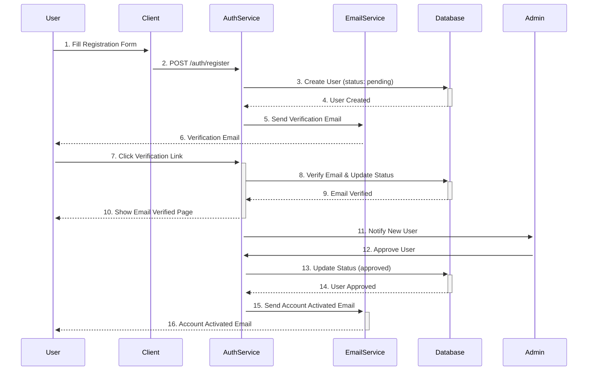
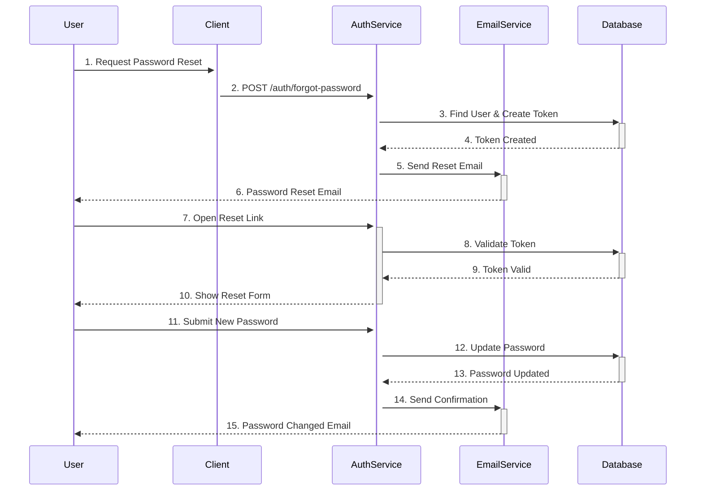

# Authentication Service

## Table of Contents
- [Authentication Flows](#authentication-flows)
  - [Registration Flow](#registration-flow)
  - [Login Flow](#login-flow)
  - [Password Reset Flow](#password-reset-flow)
- [Service Interactions](#service-interactions)
- [Endpoints](#endpoints)
- [Request/Response Examples](#requestresponse-examples)
- [Error Handling](#error-handling)
- [Security Considerations](#security-considerations)

## Authentication Flows

### Registration Flow


### Login Flow
```mermaid
sequenceDiagram
    participant User
    participant Client
    participant AuthService
    participant Database
    
    User->>+Client: 1. Enter Credentials
    Client->>+AuthService: 2. POST /auth/login
    AuthService->>+Database: 3. Find User
    Database-->>-AuthService: 4. User Found
    
    alt Account Approved
        AuthService->>+AuthService: 5. Verify Password
        AuthService->>+Database: 6. Create Session
        Database-->>-AuthService: 7. Session Created
        AuthService-->>-Client: 8. Return JWT Tokens
        Client-->>-User: 9. Show Dashboard
    else Account Pending
        AuthService-->>-Client: 10. Error: Pending Approval
        Client-->>-User: 11. Show Pending Message
    end
```

### Password Reset Flow


## Service Interactions

### Auth Service
- User authentication
- Session management
- Token generation/validation
- Account status management
- Password hashing/verification

### Email Service
- Sends verification emails
- Handles password reset emails
- Sends account status updates
- Manages email templates

### Database
- User credentials storage
- Session management
- Token storage
- Account status tracking
- [Overview](#overview)
- [Endpoints](#endpoints)
- [Request/Response Examples](#requestresponse-examples)
- [Error Handling](#error-handling)
- [Security Considerations](#security-considerations)

## Overview
The Authentication Service handles user authentication and account management, including registration, login, password recovery, and account approval workflows.

## Endpoints

### 1. Register User
```http
POST /api/v1/auth/register
```

**Request Body**
```json
{
  "email": "user@example.com",
  "password": "SecurePass123!",
  "name": "John Doe"
}
```

**Response**
```json
{
  "success": true,
  "data": {
    "id": "507f1f77bcf86cd799439011",
    "email": "user@example.com",
    "status": "pending"
  }
}
```

### 2. Login
```http
POST /api/v1/auth/login
```

**Request Body**
```json
{
  "email": "user@example.com",
  "password": "SecurePass123!"
}
```

**Response**
```json
{
  "success": true,
  "data": {
    "accessToken": "eyJhbGciOiJIUzI1NiIsInR5cCI6IkpXVCJ9...",
    "refreshToken": "eyJhbGciOiJIUzI1NiIsInR5cCI6IkpXVCJ9...",
    "user": {
      "id": "507f1f77bcf86cd799439011",
      "email": "user@example.com",
      "role": "user"
    }
  }
}
```

### 3. Forgot Password
```http
POST /api/v1/auth/forgot-password
```

**Request Body**
```json
{
  "email": "user@example.com"
}
```

**Response**
```json
{
  "success": true,
  "message": "Password reset email sent"
}
```

### 4. Reset Password
```http
POST /api/v1/auth/reset-password
```

**Request Body**
```json
{
  "token": "reset-token-from-email",
  "password": "NewSecurePass123!"
}
```

**Response**
```json
{
  "success": true,
  "message": "Password updated successfully"
}
```

### 5. Approve User (Admin)
```http
PATCH /api/v1/auth/users/{userId}/approve
```

**Headers**
```
Authorization: Bearer <admin-token>
```

**Response**
```json
{
  "success": true,
  "data": {
    "id": "507f1f77bcf86cd799439011",
    "status": "active",
    "approvedAt": "2025-10-02T12:00:00Z",
    "approvedBy": "admin-user-id"
  }
}
```

## Error Handling

### Common Error Responses

#### 400 Bad Request
```json
{
  "success": false,
  "error": {
    "code": "VALIDATION_ERROR",
    "message": "Invalid input data",
    "details": {
      "email": "Invalid email format"
    }
  }
}
```

#### 401 Unauthorized
```json
{
  "success": false,
  "error": {
    "code": "INVALID_CREDENTIALS",
    "message": "Invalid email or password"
  }
}
```

## Security Considerations

- Passwords are hashed using bcrypt
- JWT tokens have short expiration times
- Refresh tokens are stored in HTTP-only cookies
- Rate limiting on authentication endpoints
- Account lockout after multiple failed attempts
- Secure password reset tokens with expiration
