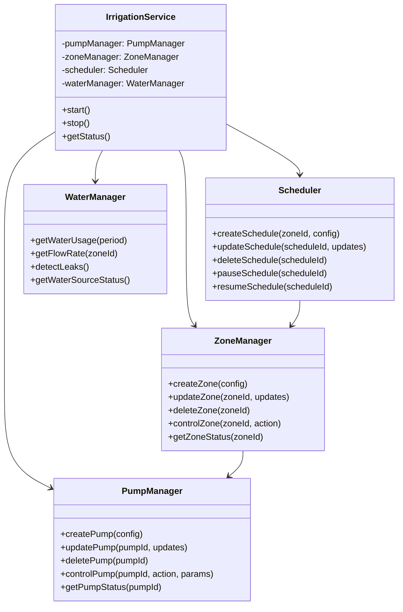
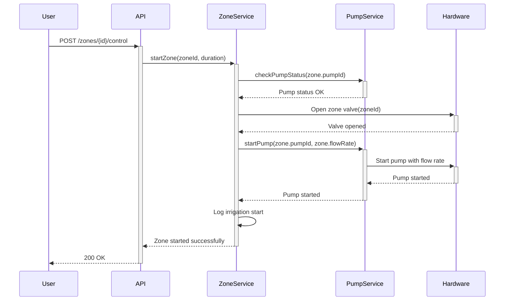

# Irrigation Service

## Table of Contents
- [Service Architecture](#service-architecture)
- [API Endpoints](#api-endpoints)
  - [Pump Management](#pump-management)
  - [Zone Management](#zone-management)
  - [Scheduling](#scheduling)
  - [Water Management](#water-management)
- [Data Models](#data-models)
- [Error Handling](#error-handling)
- [Sequence Flows](#sequence-flows)

## Service Architecture



## API Endpoints

### Pump Management

#### 1. List All Pumps
```http
GET /api/v1/irrigation/pumps
```

**Response**
```json
{
  "success": true,
  "data": [
    {
      "id": "pump-1",
      "name": "Main Garden Pump",
      "type": "submersible",
      "status": "idle",
      "flowRate": 0,
      "maxFlowRate": 50,
      "pressure": 0,
      "maxPressure": 60,
      "powerConsumption": 0,
      "lastActive": "2025-10-01T14:30:00Z",
      "health": {
        "temperature": 32.5,
        "vibration": 0.2,
        "efficiency": 98.5
      },
      "zones": ["zone-1", "zone-2"],
      "createdAt": "2025-01-15T08:00:00Z",
      "updatedAt": "2025-10-01T14:30:00Z"
    }
  ],
  "pagination": {
    "total": 1,
    "page": 1,
    "limit": 20
  }
}
```

#### 2. Get Pump Details
```http
GET /api/v1/irrigation/pumps/{pumpId}
```

**Response**
```json
{
  "success": true,
  "data": {
    "id": "pump-1",
    "name": "Main Garden Pump",
    "type": "submersible",
    "status": "idle",
    "flowRate": 0,
    "maxFlowRate": 50,
    "pressure": 0,
    "maxPressure": 60,
    "powerConsumption": 0,
    "lastActive": "2025-10-01T14:30:00Z",
    "health": {
      "temperature": 32.5,
      "vibration": 0.2,
      "efficiency": 98.5
    },
    "zones": ["zone-1", "zone-2"],
    "createdAt": "2025-01-15T08:00:00Z",
    "updatedAt": "2025-10-01T14:30:00Z"
  }
}

#### 3. Create New Pump
```http
POST /api/v1/irrigation/pumps
```

**Request Body**
```json
{
  "name": "Backyard Pump",
  "type": "surface",
  "maxFlowRate": 40,
  "maxPressure": 50,
  "zones": ["zone-3"]
}
```

**Response**
```json
{
  "success": true,
  "data": {
    "id": "pump-2",
    "name": "Backyard Pump",
    "type": "surface",
    "status": "idle",
    "flowRate": 0,
    "maxFlowRate": 40,
    "pressure": 0,
    "maxPressure": 50,
    "powerConsumption": 0,
    "health": {
      "temperature": 25.0,
      "vibration": 0.0,
      "efficiency": 100.0
    },
    "zones": ["zone-3"],
    "createdAt": "2025-10-02T10:30:00Z",
    "updatedAt": "2025-10-02T10:30:00Z"
  }
}
```

### Zone Management

#### 1. List All Zones
```http
GET /api/v1/irrigation/zones
```

**Response**
```json
{
  "success": true,
  "data": [
    {
      "id": "zone-1",
      "name": "Front Lawn",
      "pumpId": "pump-1",
      "status": "idle",
      "area": 150,
      "flowRate": 15,
      "pressure": 0,
      "vegetationType": "grass",
      "soilType": "loam",
      "lastWatered": "2025-10-01T06:00:00Z",
      "waterUsed": 225,
      "createdAt": "2025-01-15T08:00:00Z",
      "updatedAt": "2025-10-01T06:30:00Z"
    }
  ]
}
```

#### 2. Create New Zone
```http
POST /api/v1/irrigation/zones
```

**Request Body**
```json
{
  "name": "Backyard Garden",
  "pumpId": "pump-2",
  "area": 200,
  "maxFlowRate": 20,
  "vegetationType": "vegetables",
  "soilType": "sandy",
  "coordinates": [
    {"lat": 34.0522, "lng": -118.2437},
    {"lat": 34.0522, "lng": -118.2447},
    {"lat": 34.0512, "lng": -118.2447},
    {"lat": 34.0512, "lng": -118.2437}
  ]
}
```

**Response**
```json
{
  "success": true,
  "data": {
    "id": "zone-4",
    "name": "Backyard Garden",
    "pumpId": "pump-2",
    "status": "idle",
    "area": 200,
    "flowRate": 0,
    "pressure": 0,
    "maxFlowRate": 20,
    "vegetationType": "vegetables",
    "soilType": "sandy",
    "coordinates": [
      {"lat": 34.0522, "lng": -118.2437},
      {"lat": 34.0522, "lng": -118.2447},
      {"lat": 34.0512, "lng": -118.2447},
      {"lat": 34.0512, "lng": -118.2437}
    ],
    "createdAt": "2025-10-02T10:45:00Z",
    "updatedAt": "2025-10-02T10:45:00Z"
  }
}
```

### Water Management

#### 1. Get Water Usage
```http
GET /api/v1/irrigation/water/usage?period=month&year=2025&month=10
```

**Response**
```json
{
  "success": true,
  "data": {
    "period": "2025-10",
    "totalUsage": 1250.75,
    "byZone": [
      {
        "zoneId": "zone-1",
        "zoneName": "Front Lawn",
        "usage": 450.25,
        "percentage": 36
      },
      {
        "zoneId": "zone-2",
        "zoneName": "Back Garden",
        "usage": 800.50,
        "percentage": 64
      }
    ],
    "dailyAverage": 41.69,
    "comparison": {
      "previousPeriod": 1380.25,
      "change": -9.4
    },
    "waterSavings": {
      "amount": 129.5,
      "percentage": 9.4,
      "equivalent": 865
    }
  }
}
```
```

## Pump Control

### 1. Control Pump
```http
POST /api/v1/irrigation/pumps/{pumpId}/control
```

**Request Body**
```json
{
  "action": "start",  // or "stop"
  "flowRate": 30,    // L/min
  "duration": 1800,  // in seconds (optional)
  "zoneId": "zone-1" // optional for logging
}
```

**Response**
```json
{
  "success": true,
  "data": {
    "id": "pump-1",
    "status": "running",
    "flowRate": 30,
    "estimatedCompletion": "2025-10-02T11:00:00Z"
  }
}
```

### 2. Update Pump Settings
```http
PATCH /api/v1/irrigation/pumps/{pumpId}
```

**Request Body**
```json
{
  "name": "Main Garden Pump - Updated",
  "maxFlowRate": 55.0,
  "maxPressure": 65.0,
  "zones": ["zone-1", "zone-2", "zone-3"]
}
```

**Response**
```json
{
  "success": true,
  "data": {
    "id": "pump-1",
    "name": "Main Garden Pump - Updated",
    "maxFlowRate": 55.0,
    "maxPressure": 65.0,
    "zones": ["zone-1", "zone-2", "zone-3"],
    "updatedAt": "2025-10-02T11:15:00Z"
  }
}
```

## Scheduling

### 1. Create Schedule
```http
POST /api/v1/irrigation/schedules
```

**Request Body**
```json
{
  "name": "Morning Watering",
  "zoneId": "zone-1",
  "type": "recurring",
  "days": [1, 2, 3, 4, 5],  // 0-6 (Sun-Sat)
  "startTime": "06:00",
  "duration": 1800,  // seconds
  "enabled": true,
  "weatherAware": true,
  "weatherConditions": {
    "minTemp": 5,
    "maxTemp": 30,
    "precipitationThreshold": 5
  }
}
  "startTime": "06:00",
  "duration": 30,
  "days": ["monday", "wednesday", "friday"],
  "weatherAware": true,
  "skipIfRained": true
}
```

## Data Models

### Pump
```typescript
interface Pump {
  id: string;
  name: string;
  status: 'offline' | 'idle' | 'priming' | 'pumping' | 'error';
  flowRate: number;  // L/min
  pressure: number;  // PSI
  powerConsumption: number;  // Watts
  lastActive: Date;
  zones: Zone[];
  settings: PumpSettings;
}

interface PumpSettings {
  maxFlowRate: number;
  autoShutoffPressure: number;
  lowPressureThreshold: number;
  highPressureThreshold: number;
}
```

### Zone
```typescript
interface Zone {
  id: string;
  name: string;
  status: 'idle' | 'watering' | 'paused' | 'error';
  schedule: Schedule;
  lastWatered?: Date;
  waterUsed: number;  // in liters
  vegetationType: string;
  soilType: string;
  area: number;  // in square meters
}

## Data Models

### Pump
```typescript
interface Pump {
  id: string;
  name: string;
  type: 'submersible' | 'surface' | 'booster';
  status: 'idle' | 'starting' | 'running' | 'stopping' | 'error';
  flowRate: number;  // L/min
  pressure: number;  // PSI
  maxFlowRate: number;
  maxPressure: number;
  powerConsumption: number;  // Watts
  lastActive: Date;
  health: {
    temperature: number;  // °C
    vibration: number;    // mm/s²
    efficiency: number;   // %
  };
  zones: string[];
  createdAt: Date;
  updatedAt: Date;
}
```

### Zone
```typescript
interface Zone {
  id: string;
  name: string;
  pumpId: string;
  status: 'idle' | 'starting' | 'irrigating' | 'stopping' | 'error';
  area: number;           // m²
  flowRate: number;       // L/min
  pressure: number;       // PSI
  maxFlowRate: number;    // L/min
  vegetationType: string;
  soilType: string;
  coordinates: Array<{lat: number, lng: number}>;
  lastWatered?: Date;
  waterUsed: number;      // liters
  createdAt: Date;
  updatedAt: Date;
}
```

### Schedule
```typescript
interface Schedule {
  id: string;
  name: string;
  zoneId: string;
  type: 'one-time' | 'recurring';
  days: number[];  // 0-6 (Sun-Sat)
  startTime: string;  // HH:MM
  duration: number;   // seconds
  enabled: boolean;
  weatherAware: boolean;
  weatherConditions?: {
    minTemp?: number;  // °C
    maxTemp?: number;  // °C
    precipitationThreshold?: number;  // mm
    windSpeedThreshold?: number;      // km/h
  };
  lastRun?: Date;
  nextRun?: Date;
  createdAt: Date;
  updatedAt: Date;
}
```

## Error Handling

### Common Error Responses

#### 400 Bad Request
```json
{
  "success": false,
  "error": {
    "code": "INVALID_INPUT",
    "message": "Invalid input parameters",
    "details": {
      "flowRate": "Must be between 0 and 100"
    }
  }
}
```

#### 404 Not Found
```json
{
  "success": false,
  "error": {
    "code": "ZONE_NOT_FOUND",
    "message": "Zone with ID 'zone-999' not found"
  }
}
```

#### 409 Conflict
```json
{
  "success": false,
  "error": {
    "code": "PUMP_IN_USE",
    "message": "Pump is currently in use by another zone"
  }
}
```

#### 500 Internal Server Error
```json
{
  "success": false,
  "error": {
    "code": "HARDWARE_ERROR",
    "message": "Failed to communicate with irrigation controller",
    "details": "Timeout waiting for response"
  }
}
```

## Sequence Flows

### Starting Zone Irrigation


### Processing Scheduled Irrigation
```mermaid
sequenceDiagram
    participant Scheduler
    participant ZoneService
    participant WeatherService
    participant NotificationService
    
    Scheduler->>Scheduler: Check for due schedules
    Scheduler->>+WeatherService: Get forecast(zone.location)
    WeatherService-->>-Scheduler: Weather data
    
    alt Weather conditions met
        Scheduler->>+ZoneService: startZone(zoneId, schedule.duration)
        ZoneService-->>-Scheduler: Zone started
        
        Scheduler->>+NotificationService: sendNotification({
        |   type: 'irrigation_started',
        |   zone: zoneId,
        |   duration: schedule.duration
        |})
        NotificationService-->>-Scheduler: Notification sent
    else Weather conditions not met
        Scheduler->>+NotificationService: sendNotification({
        |   type: 'irrigation_skipped',
        |   zone: zoneId,
        |   reason: 'weather_conditions'
        |})
        NotificationService-->>-Scheduler: Notification sent
    end
```
```

## Error Handling

### 400 Bad Request
```json
{
  "success": false,
  "error": {
    "code": "INVALID_ACTION",
    "message": "Invalid action specified. Must be 'start' or 'stop'"
  }
}
```

### 409 Conflict
```json
{
  "success": false,
  "error": {
    "code": "PUMP_BUSY",
    "message": "Pump is currently active in another zone"
  }
}
```

### 503 Service Unavailable
```json
{
  "success": false,
  "error": {
    "code": "PUMP_OFFLINE",
    "message": "Pump is not responding"
  }
}
```

## WebSocket Events

### Pump Status Update
```json
{
  "event": "pump:status",
  "data": {
    "pumpId": "pump-1",
    "status": "watering",
    "zoneId": "zone-1",
    "flowRate": 12.5,
    "pressure": 45.2,
    "timestamp": "2025-10-02T08:15:30Z"
  }
}
```

### Zone Watering Complete
```json
{
  "event": "zone:watering_complete",
  "data": {
    "zoneId": "zone-1",
    "pumpId": "pump-1",
    "duration": 300,
    "waterUsed": 62.5,
    "timestamp": "2025-10-02T08:20:00Z"
  }
}
```
